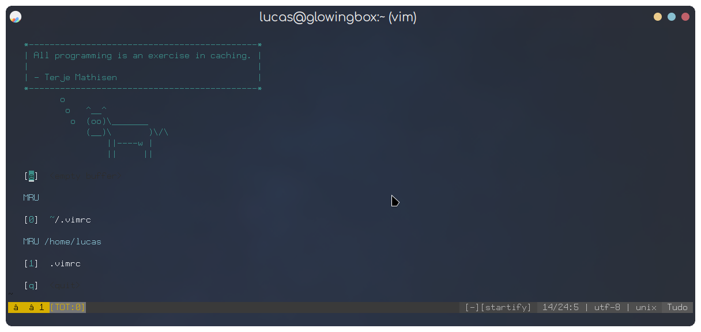
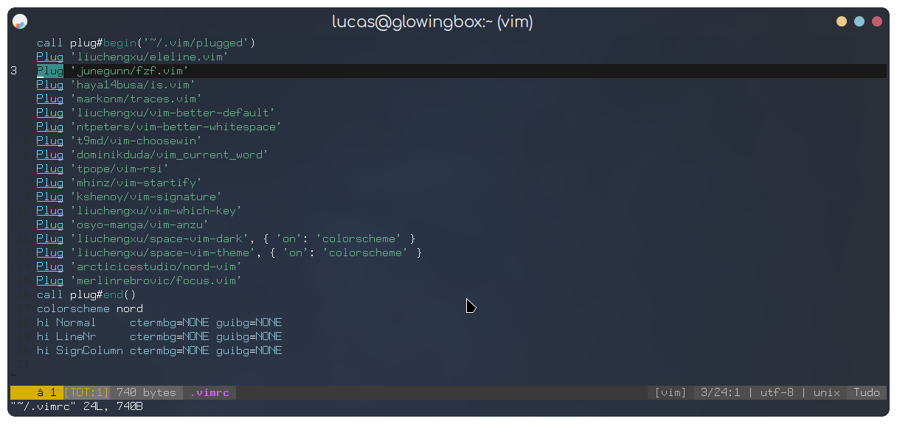
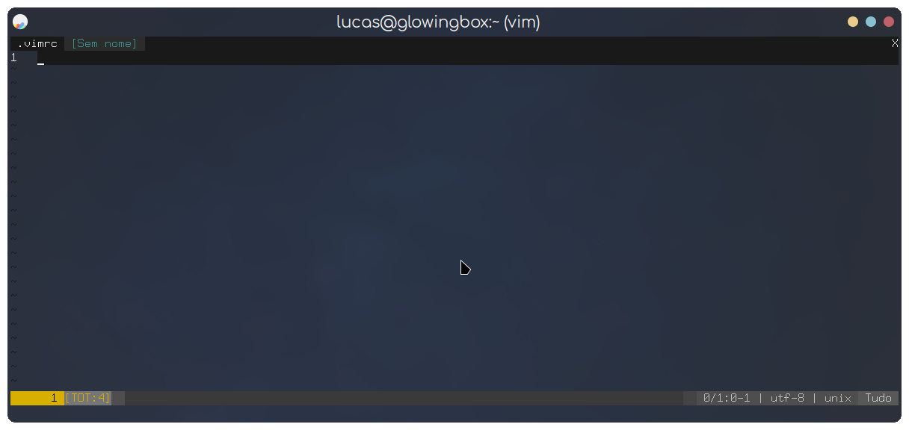
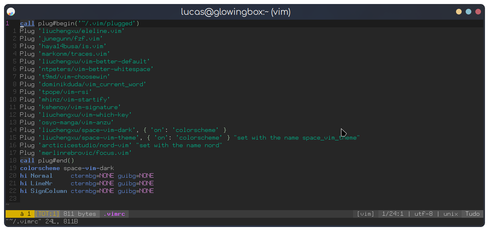

# my-vim-distro

This would be my config if I could use *Vim*.

This is a simple yet mostly complete *Vim* configuration with plugins, which can be considered as a distro as far as I know. \
To see what text editor and other software I am actually using in my desktop see my [dotfiles](https://github.com/Firespindash/dotfiles) repo.
I tried to keep it as simple as possible so only a single file is needed, because the plugins are in *GitHub* as well there seem to be no need to redistribute them in this repo. Anyway, take a look at it: \
Screenshot of the welcome/start page with the _nord_ theme.

Screenshot of the main page workflow.

Screenshot of the main page with tabs.

Screenshot of the main page with the _space-vim-dark_ theme.

## Setup
To install it, copy the `vimrc` config file to your `$HOME` directory renaming it to `.vimrc`. \
Then, create a `.vim` directory with `autoload` and `plugged` subdirectories. \
And, download [vim-plug](https://github.com/junegunn/vim-plug) and put the `plug.vim` in the `autoload` directory. \
It is usually done with:
```
cp vimrc ~/.vimrc
mkdir -p ~/.vim/autoload && mkdir ~/.vim/plugged
curl -fLo ~/.vim/autoload/plug.vim --create-dirs \
 https://raw.githubusercontent.com/junegunn/vim-plug/master/plug.vim
mv plug.vim ~/.vim/autoload/
```
After that, just open *Vim* and type `:PlugInstall` in the command bar. \
It should install all of the plugins in the list, and open a new panel in the editor apparently.
## Details
I created this in the time that I was amazed by customizing everything. But, it did not stay for long as I cannot use *Vim*. My goal at the time was to have a text editor that I could have something like a immersive/focus mode. I was customizing *Vim* in an attempt to make it work at least more as I expected with features I wanted a nice text editor to have, but I stopped right when I reached the point where I had to add the focus mode feature. It usually is about centering the code at the middle of the page/window and removing the status bar, sometimes. What I wanted to achieve is something like automatically entering in the focus mode and use it in fullscreen, I thought it had an awesome appearance to it and felt that it would boost my productivity. After that, I went to *Neovim* where something more like what I wanted existed and did my experiments. I ended up stopping too and lost my configs, also I lost my original `~/.vimrc` as well. So, I had to hack up something together that resembles a bit how the original file looked like, at least the most important things that I remember being in there. In the end, I dropped it starting to like more when something I use has good defaults and is more natural to use, it is a really good feeling when what you are using with the best parts of your customization/configuration is used by other people and supported by a community with advanced users. What I mean is that my *micro* config is about 4 lines, it has lots of good defaults, I do not need to put any file in my home dir nor creating any dirs by default, and it is available in most distros. \
Also, in that time I already liked the _Nord_ colorscheme theme, and it still is the theme that fits better with my desktop environment configuration. It had some changes in the process of deploying this config, but I kept the themes I tested that I find are the best, things like adding comments to the config file itself. A left the [space-vim-theme](https://github.com/liuchengxu/space-vim-theme) theme in the config because the _space-vim-dark_ and the dark version of _space-vim-theme_ actually have slightly different colors. \
I ended up keeping the main original `.vim` directory because I felt it realistic had some useful configurations, specially for coding. For instance, things like the highlight on all appearances of a word, improved searching, a slightly color change in the background where a space in the end of a line was left, auto-trim excessive newline in the end of file, and other quality of life improvements. \
I did not change much the defaults in the config, you may have realized, because I found them actually good when I was using it, and again because I was just making experiments with it. But I mean, *Vim* has some annoyances that got me out of it, like *Neovim*. And to be honest, I do not know any terminal-based text editor that would not have any annoyance without extensive customization, at minimum or a lot of headache, which I do not like, I even planned to create an application of this kind one time. 
## Known Caveats
- Because *Vim* uses the terminal font, the status bar icons font cannot be changed so the left side icons will not appear depending on your *fontconfig* or system font configuration defaulting to some _Unicode_ characters in most cases, like in the screenshots.
- When trying to use the focus mode the left side of the page may glitch apparently, tested only in my [st](https://github.com/Firespindash/st) terminal.
